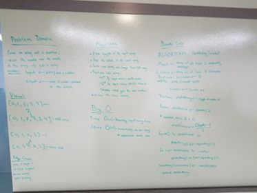

# data-structures-and-algorithms
CF 401 .NET - Code Challenge 1

# Insert and shift middle index of array
Manipulate arrays without relying on built-in array methods.

## Challenge
Given an array of unknown length and a number, return an array the same as the given array except with the number inserted into the center position. (If odd, aim right.) Use no built-in array methods.

## Approach & Efficiency
I used a try-catch block inside a while loop to test for validity at each index and increment a counter if valid ('try'). When invalid, instead of crashing, the 'catch' wraps up the counter and flips the 'while' condition to terminate the loop.  The counter serves as the length for instantiating a new array, which is populated in 3 phases: 
  - elements left of the identified centerpoint inherit values from the SAME index in the input array 
  - elements right of the identified centerpoint inherit values from the 'index-1' in the input array
  - the identified centerpoint gets the new number
(Although they *might* work as coded,...) I ignored testing the potentially problematic cases where the input array is:
  - empty (ideally, would return array with just 1 element that is the new number)
  - length 1 (would return an array with original element 0 and new number in index 1)

## Solution
