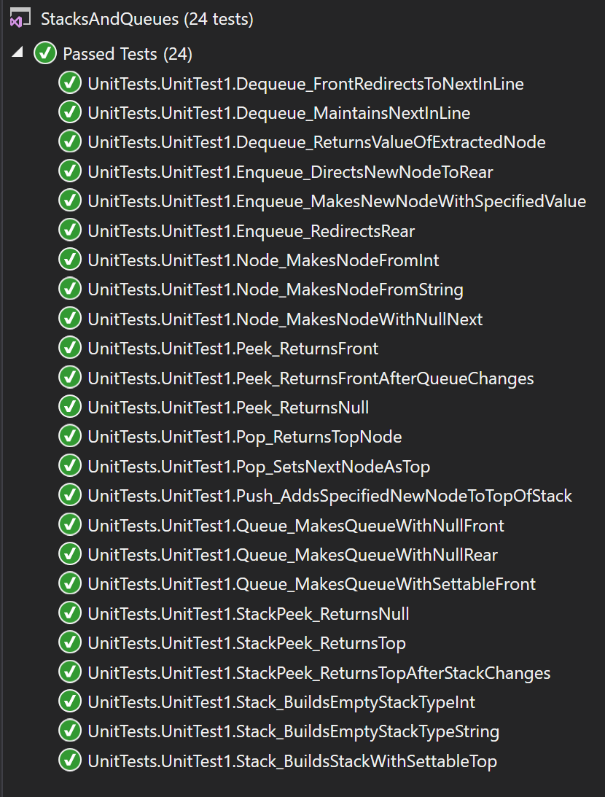

# data-structures-and-algorithms
CF 401 .NET - Lab 10 - Stacks and Queues

# Create new classes for Stacks and Queues
'Classes' contains classes for Stack, Queue, and Node. Classes contain methods to facilitate common actions for each structure, including constructing, adding, removing, and viewing.

## Challenge
Create a Node class with the following properties and methods:
 - Value: integer value contained in the node (required)
 - Next: Node object that references the next node in the same queue/stack (null ref at instantiation)
 - Node (constructor): requires int input to assign initial value of node object
Create a Stack (FILO/LIFO) class with the following properties and methods:
 - Top: Node object that references the stack's 'Top' node
 - Push(value): Creates a new node of specified value and adds it to the 'Top' of the stack.
 - Pop(): Removes the Top node and returns its value, and reassigns Top to next in line.
 - Peek(): Returns a reference to Top for viewing.
 Create a Queue (FIFO/LILO) class with the following properties and methods:
 - Front: Node object that references the node at the front of the queue
 - Rear: Node object that references the node at the rear of the queue
 - Enqueue(value): Creates a new node of specified value and adds it to the rear of the queue
 - Dequeue(): Removes the Front node and returns its value, and reassigns Front to next in line
 - Peek(): Returns a reference to the Front for viewing.

## Approach & Efficiency
Each method manipulates the structures only from the accessible 'ends' (ie - Top for Stacks, Front/Rear for Queues), attaching to end nodes and reassigning their 'end' designators (Top, Front, Rear) to the next node. Hence, for efficiency, ataset size is immaterial - time complexity is therefore O(1) for all methods. Space allocation is limited to a constant (again, dataset size is immaterial), so space complexity is O(1).

## Solution
This challenge included a set of unit tests verifying that:
  - Constructors can build empty structures (constructors that instantiate with a node value not tested)
  - Methods that add new nodes correctly attach the new nodes and reassign 'end' designators properly
  - Methods that remove nodes correctly detach them, return their values, and reassign 'end' designators properly
  - Peek methods return the correct references, even if null

 