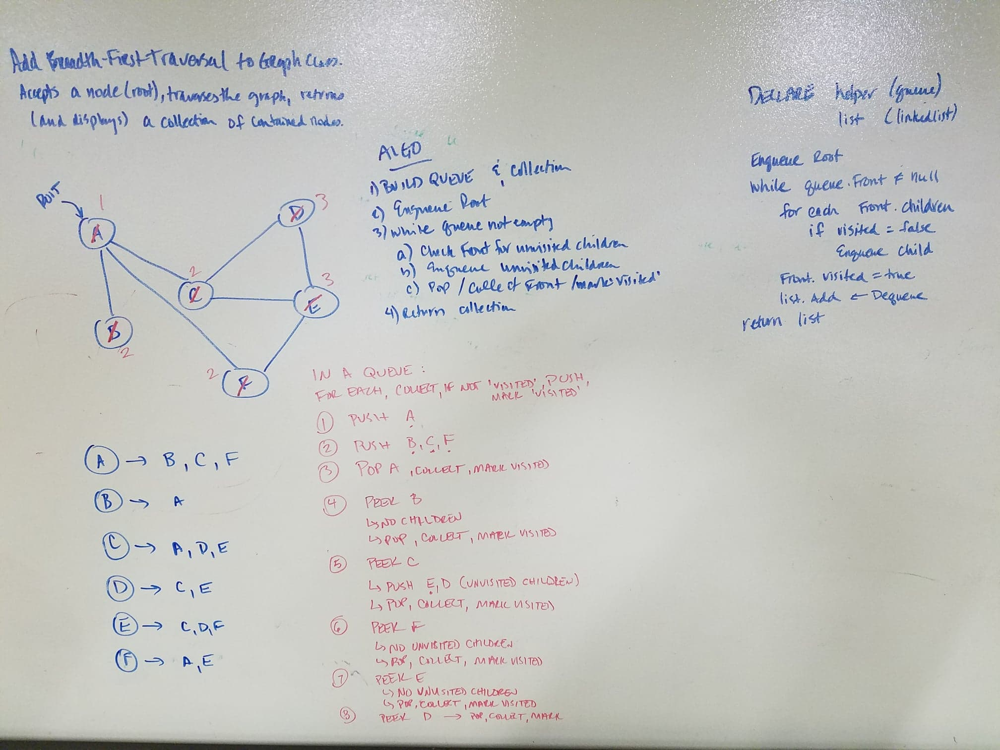
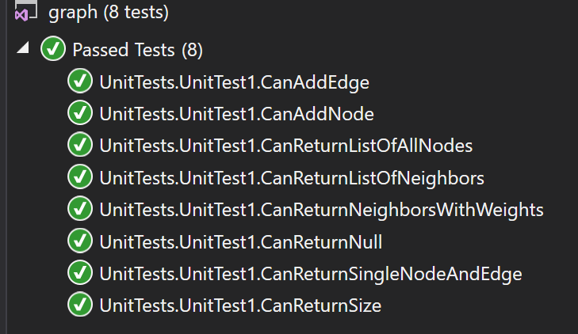

# data-structures-and-algorithms
CF 401 .NET - Graphs

# Create custom implementation for Hashtable
'Classes' contains new 'Graphs' class with LinkedList of all nodes in the graph. Each node contains a list of its neighbors and weights (see 'linked_list' for master node for all data structures). This represents the 'adjacency list', which is one common implementation of a graph's structure.

## Challenge
Implement a Graph with the following methods:  
  AddNode: Adds a single node of specified value to an existing graph.  
  AddEdge: Adds an edge of specified weight between 2 specified nodes already in the graph.  
  GetNodes: Gets a list of all nodes in a graph.  
  GetNeighbors: Gets a list of all neighbors of a node in a graph.  
  BreadthFirst: Gets a list of all nodes in a graph, using breadth-first traversal.  

## Approach
The chosen implementation (linked list of nodes, each containing a list of adjacencies) lends itself to easy traversal for all methods. If searching for a specific node, the Vertices list (in Graph class) contains all - simply use the LinkedList methods to locate the specific node, and any processing, manipulation, or traversal from that point is done by accessing its list of adjacencies. Also, the listed methods largely rely on passed-in references to existing nodes, so there is no searching in those cases. As such, time/space complexity are O(1) for single node operations (AddNode, AddEdge) and O(n) for those requiring a full collection returned (GetNodes, GetNeighbors, BreadthFirst).

## Unit Tests
Unit tests verify:
  Node can be successfully added to the graph  
  An edge can be successfully added to the graph  
  A collection of all nodes can be properly retrieved from the graph  
  All appropriate neighbors can be retrieved from the graph  
  Neighbors are returned with the weight between nodes included  
  The proper size is returned, representing the number of nodes in the graph  
  A graph with only one node and edge can be properly returned  
  An empty graph properly returns null  

