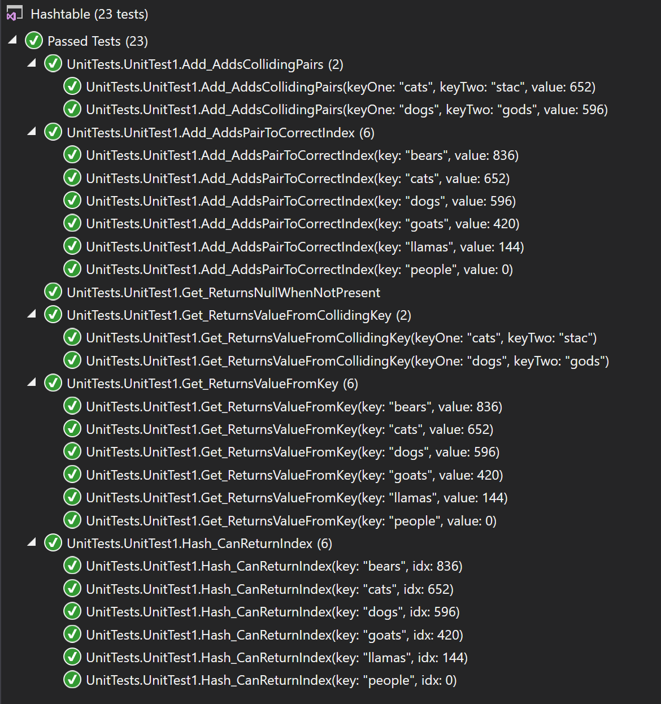

# data-structures-and-algorithms
CF 401 .NET - Hashtables

# Create custom implementation for Hashtable
'Classes' contains new 'Hashmap' class. Added 'Key' to LinkedList 'Node' class to accommodate key-value pairs. Refactored (ie - changed 'int' values to 'Object') and overloaded supporting methods (to accept 'Key') in 'LinkedList' class, and constructors in 'LinkedList' and 'Node', to accommodate hashmap features.

## Challenge
Implement a Hashtable with the following methods:  
  Hash: takes in an arbitrary key and returns an index in the collection.  
  Add: takes in both the key and value. This method should hash the key, and add the key and value pair to the table, handling collisions as needed.  
  Get: takes in the key and returns the value from the table.  
  Contains: takes in the key and returns a boolean, indicating if the key exists in the table already.  
...and properties:  
  Buckets: array of LinkedLists (null on construction, but of caller-specified length)  
  _size: caller-specified length (backing store - value assigned at construction)  

## Approach
'Hash' casts the caller-specified key (Object) to (string), multiplies the ASCII values of all its characters together and then by 599, and returns the remainder of that value divided by the length of the table (_size), which is the hashed index for that key.  
'Add' hashes the key and instantiates a LinkedList at the hashed index (in Buckets) if empty. It then uses the LinkedList 'Append' method (refactored to support 'key' containing nodes) to add the caller-specified key/value pair to the end of the LinkedList at that index.  
'Get' hashes the key and searches the LinkedList at that location for the specified key (using LinkedList.Find, overloaded to accept key Object) and returns the node's value (or 'null' if key not found).  
'Contains' sends the caller-specified key to 'Get', and it compares the returned value to the caller-specified value. If they match (and not null), it returns 'true' to confirm presence. 

## Unit Tests
Unit tests (and console cases) verify that the Hashmap class:  
 - Adding a key/value to your hashtable results in the value being in the data structure  
 - Retrieving based on a key returns the value stored  
 - Successfully returns null for a key that does not exist in the hashtable  
 - Successfully handle a collision within the hashtable  
 - Successfully retrieve a value from a bucket within the hashtable that has a collision  
 - Successfully hash a key to an in-range value  

