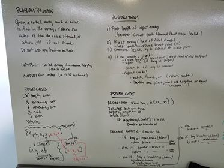

# data-structures-and-algorithms
CF 401 .NET - Code Challenge 3 - Array Binary Search

# Find a value in an array
Manipulate arrays without relying on built-in array methods.

## Challenge
Given an array of unknown length and a number, locate the number in the array and return its index, or return -1 if the array does not contain the number. Use no built-in array methods.
Example
Input                      Output
[4,8,15,16,23,42], 15	        2
[11,22,33,44,55,66,77], 90	 -1

## Approach & Efficiency
Since the input array is sorted, I bisected it and compared the search key to the value of the element at the array's midpoint. If the key is larger than the element, I bisected the array section to the right of it; if smaller, I bisected left... and I repeated the midpoint value comparison. I continued that process until:
 - a match was found (return index of match), or
 - I ran out of array to check (return -1, meaning 'no match found')
Efficiency:
(Time) O(log n). Bisecting the array, and then the bisection, and so on is logarithmic because the size of the bisections shrinks exponentially with each bisection. In other words, this efficiency improves with data set growth.
(Space) O(1). Only a fixed number of temp variables are created - it's constant regardless of data size. In other words, this efficiency improves with data set growth.

## Solution
BigO: This whiteboard image does not address efficiency, but it is addressed above in "Approach & Efficiency"

## Credit
Whiteboarding was a collaborative effort by:
 - Ahmad Ali - https://github.com/ahmad62597
 - Gwen Zubatch - https://github.com/GwennyB

