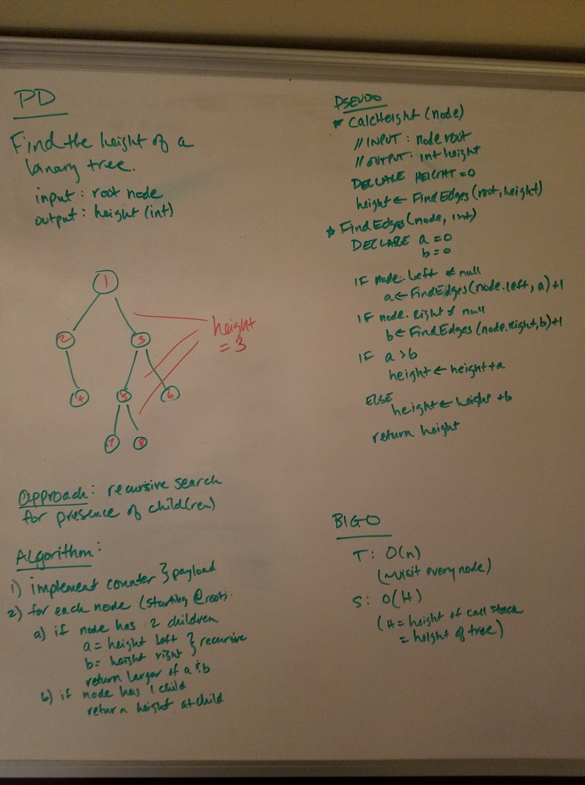
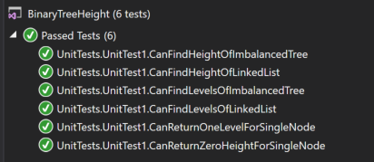

# data-structures-and-algorithms
CF 401 .NET - Code Challenge - Find Binary Tree Height

## Challenge
Implement a method with the following signature int CalculateBinaryTreeHeight(Node root) that calculates the height of a binary tree.

Once you calculate the height of a tree, write a similar function to calculate the number of levels for a tree.

## Approach
This solution uses recursion to search for edges (ie - presence of children). It uses (and recycles) 2 constants ('a' and 'b') to log edge count along alternate paths below a root (left and right) - the longer of the 2 paths are added to the accumulated height constant and passed up the stack.

A second method uses the above logic combined with the understanding that a tree of height n has n+1 levels to calculate total number of levels (height + 1).

Whiteboard representation of the solution approach:

## Efficiency
This approach has a time complexity of O(n) since it must touch each node at least once to confirm full edge count. Space complexity is O(1) since no new memory is allocated. 

## Solution
This challenge included a set of unit tests verifying that:  
  - height and level count are properly calculated for imbalanced tree
  - height and level count are properly calculated for a linked list
  - methods can handle empty or single node trees

