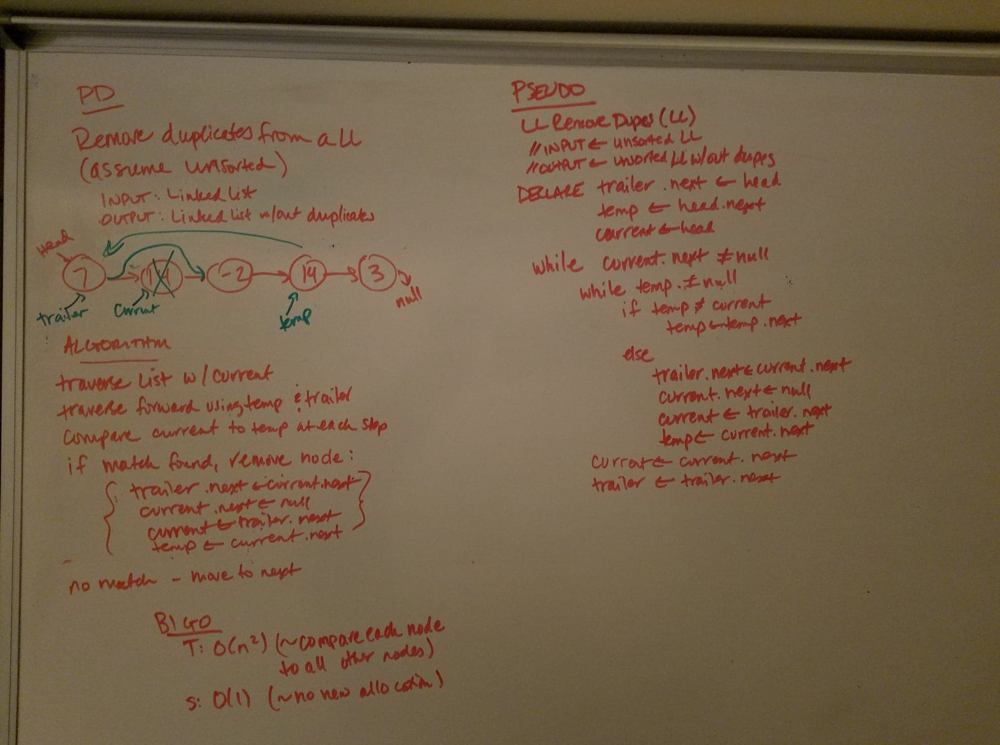

# data-structures-and-algorithms
CF 401 .NET - Code Challenge - Find Binary Tree Height

## Challenge
Implement a method with the following signature LinkedList RemoveDuplicatens(LinkedLst list) that removes all duplicated values from the linked list. The modifications must happen in place (i.e. avoid making a copy of the linked list)

## Approach
This solution uses 2 helper nodes to traverse the list (along with 'Current'):  
  'trailer': follows 1 node behind 'Current' to enable last/next referencing for node removal if/when needed  
  'temp': traverses all nodes after 'Current' to check for matches  
When 'Current' matches 'temp':  
  'trailer.Next' points past 'Current' to 'Current.Next'
  'Current.Next' points to null
  'Current' reassigns to 'trailer.Next'
  'temp' moves back adjacent to 'Current' to start its search from this node
Using 'trailer' created the need for a pre-Head dummy node (so that 'trailer' doesn't cause a null ref exception). 
Edge cases include:
  if Head is duplicated - its removal must be accompanied by Head reassignment
  null or single-node list
  a list of all the same value

Whiteboard representation of the solution approach:

## Efficiency
This approach has a time complexity of O(n) since it must touch each node at least once (many twice), but it doesn't circle back on itself for an O(n^2) solution. Space complexity is O(1) since no new memory is allocated. 

## Solution
This challenge included a set of unit tests verifying that:  
  - empty or single-node lists return exactly what was passed in
  - all duplicates are removed when the list contains many of the same value
  - duplicate at head is removed with head properly reassigned

