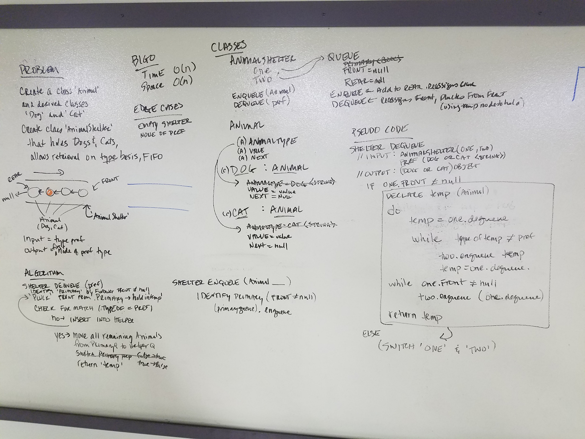

# data-structures-and-algorithms
CF 401 .NET - Code Challenge 12 - FIFO Animal Shelter

## Challenge
Create a class called AnimalShelter which holds only dogs and cats and places animals using FIFO. Receive animals (dogs and cats) into the shelter using 'Enqueue()' method, and place animals with new owners according to their type preference (dog or cat) using 'Dequeue' method.

## Approach
AnimalShelter is FIFO, so model its behaviors after a standard Queue. Since it holds 2 derived data types, and the animals aren't sorted by type, and adopters get to choose which type to remove from the queue, the standard behaviors must be accomplished using a Helper queue. During Dequeue, each animal is compared in turn to the type preference - the first to match gets returned, and non-matches get moved to Helper. Once all animals are moved, Primary becomes Helper and vice versa.

Whiteboard representation of the solution approach:

## Class Structure
'Classes' contains classes for AnimalShelter, Animal, Dog(:Animal), Cat(:Animal), and Queue. Classes contain properties and methods to facilitate common actions for each structure, including constructing, adding, removing, and viewing.
Create a AnimalShelter class with the following properties and methods:
 - QOne & QTwo: Queue structures that hold Animals at any given state
 - Primary: Ref to whichever Queue is acting as the primary at the time
 - Helper: Ref to whichever Queue is acting as the helper at the time
 - Enqueue(): Adds a new animal to the shelter
 - Dequeue(type): Finds the first animal of specified type, removes it from the queue, re-combines the remainder of the queue (into Helper), switches Primary and Helper refs, and returns the selected animal
Create a Queue class with the following properties and methods:
 - Top: Node object that references the stack's 'Top' node
 - Enqueue(Animal): Adds a passed-in Animal to the active queue, resets Rear to new Animal.
 - Dequeue(): Removes/returns the Animal at Front of queue, resets Front to next.
 - Peek(): Returns a reference to queue's Front for viewing.
Create a Animal class with the following properties and methods:
 - Name: animal's name, set by derived class construtors
 - Species: Values set by derived class constructors
 - Next: next in line
 - Derived classes: Dog, Cat

## Efficiency
AnimalShelter.Enqueue requires only access to the Rear of the Primary queue, which is always exposed; therefore, both Time and Space complexity are O(1). AnimalShelter.Dequeue requires allocation of a 2nd queue of equal length (ie - memory allocation is double the size of the dataset), and full traversal of the queue is required for every call, so both Time and Space complexity are O(n).

## Solution
This challenge included a set of unit tests verifying that:
  - TBD
<!--  -->
