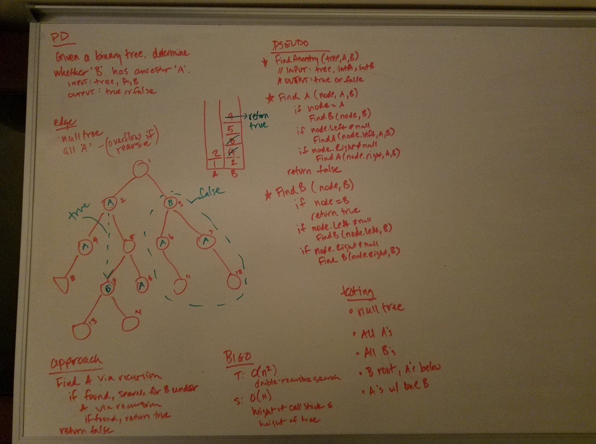
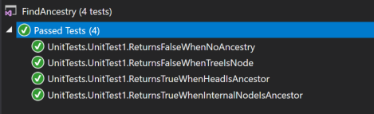

# data-structures-and-algorithms
CF 401 .NET - Code Challenge - Find Ancestry

## Challenge
Determine if two values in a binary tree have an ancestry relationship. (3 Points)
Implement a method with the following signature bool IsAncestor(int A, int B, Node root) that returns true if the value A is an ancestor of the value B in the provided binary tree; the function will return false otherwise.

You can assume that the binary tree will have unique values.
A classical definition of ancestor nodes: “Any node present in the path from that node to the root node (including the root node)”

## Approach
This solution uses a double-recursive approach. First, it recursively searches for the presence of the proposed ancestor (value 'A'). Once found, it searches within the sub-tree under 'A' for the occurrence of 'B' (the proposed successor). If 'B' is found within 'A', all recursive searches pass back 'true' and the search ceases.

Whiteboard representation of the solution approach:

## Efficiency
This approach has a time complexity of O(n) since it searches each sub-tree (rooted at 'A') just once. It has a space complexity of O(H) since the call stack can reach as high as the tree itself. 

## Solution
This challenge included a set of unit tests verifying that:
  - the method returns 'false' when no ancestry relationship is present
  - the method returns 'false' when the tree is a single node or null
  - the method returns 'true' when ancestry relationship is present, whether the ancestor is at the root or on an internal node

