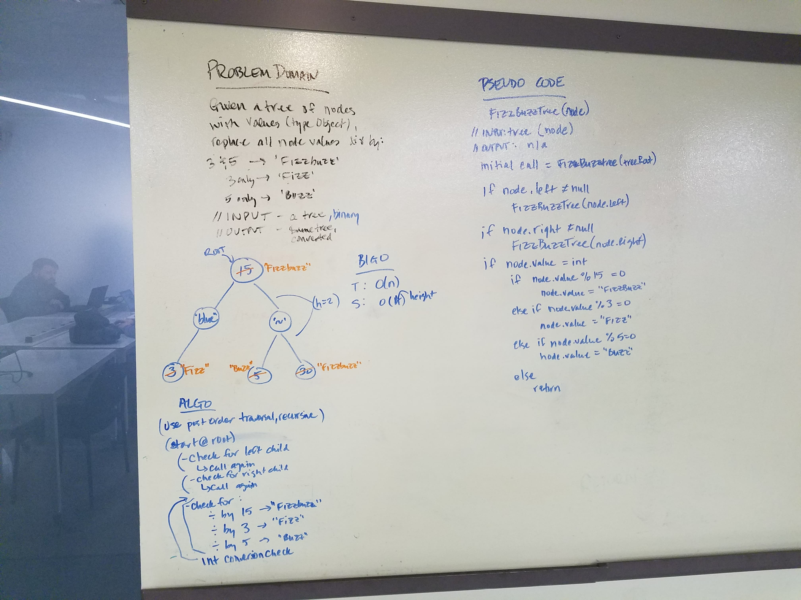
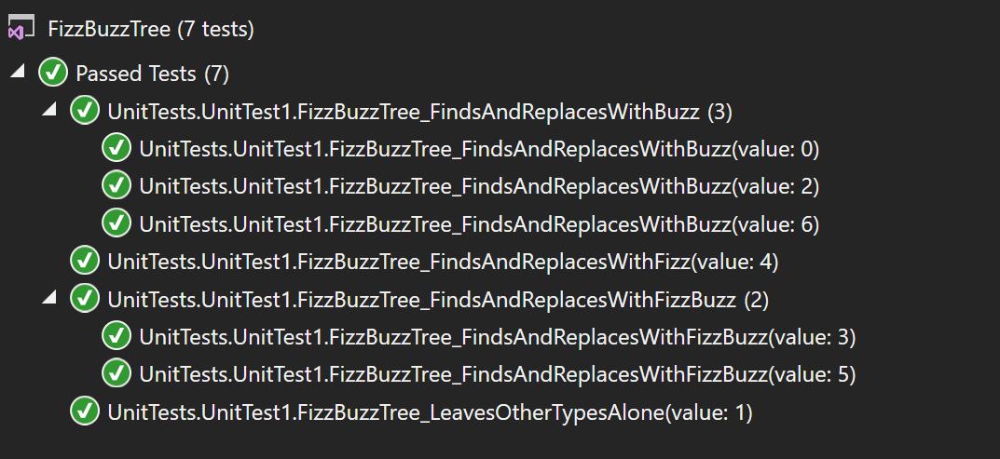

# data-structures-and-algorithms
CF 401 .NET - Code Challenge 16 - Fizz Buzz Tree

# Traverse a tree and manipulate its nodes' values
Given a binary tree, change each node's value as follows:
  - if divisible by 3, change to 'Fizz'
  - if divisible by 5, change to 'Buzz'
  - if divisible by both 3 and 5, change to 'FizzBuzz'

## Installation / Run Instructions
1. Clone this repo locally.
2. Launch \\code-challenges-401\challenges\FizzBuzzTree\FizzBuzzTree\FizzBuzzTree.csproj (in Visual Studio 2017 or later).
3. Compile and run - console will launch with solutions automatically as shown below:

## Approach
Recursive solution: Traverse tree via any depth-first ordering.
 - Check each node for:
    - if: divisible by 15 (product of 3 and 5), change to 'FizzBuzz' (capture this before trying 3 and 5 individually for efficiency)
    - else if: divisible by 3, change to 'Fizz'
    - else if: divisible by 5, change to 'Buzz'

Solution approach:

## Efficiency
Since this solution is recursive, time efficiency is O(n) and space is O(H) (height of tree, allocated on the stack).

## Unit Tests
Unit tests (and console cases) verify that:
 - 15, 3, and 5 multiples are properly identified and changed
 - other values are not changed
 - different data types don't generate an error or exception

