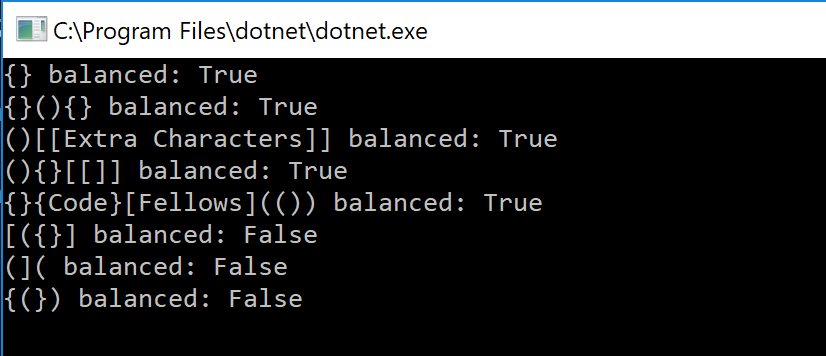
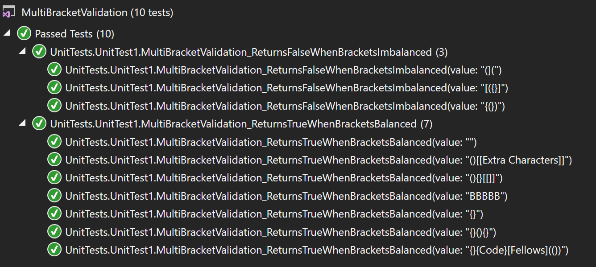

# data-structures-and-algorithms
CF 401 .NET - Code Challenge 13 - Bracket Balance Validation

## Challenge
(Console app) Given any string, determine whether any brackets in it are balanced (ie - opened and closed, and in proper order). Return 'true' for balanced or 'false' for imbalanced.

Examples:

INPUT	                  OUTPUT
{}	                    TRUE
{}(){}	                TRUE
()[[Extra Characters]]	TRUE
(){}[[]]	              TRUE
{}{Code}[Fellows](())	  TRUE
[({}]	                  FALSE
(](	                    FALSE
{(})	                  FALSE

## How To Run This Application
1. Clone the repo.
2. Launch /challenges/MultiBracketValidation/MultiBracketValidation/MultiBracketValidationChallenge.csproj (in Visual Studio 2017 or later).
3. Press F5 to compile and run in the Console.

## Approach
An empty queue is instantiated. The string is split into a char array. Each element in turn is inspected - 
if it is a(n):                                  a switch:
* character other than interesting brackets       ignores it and moves on
* opening bracket (of types '(','[', or '{')      pushes it into the queue
* closing bracket (of types ')',']', or '}')      checks whether the last bracket pushed to the queue is its mate. 
                                                  If yes, it pops the top and moves on.
                                                  If no, it returns 'false' (ie - reports an imbalance).
If an imbalance isn't identified during the above described triage, the method returns 'true' if the queue has been cleared (ie - no opening brackets have been left unmatched with a closing bracket), or returns 'false' if the queue still contains any brackets (ie - left unmatched).

## Efficiency
All 'n' characters of the string must be touched, so time complexity is O(n). Memory allocation is constant regardless of string length, so space complexity is O(1).

## Testing
Tests verify that the method returns 'true' for strings with balanced brackets, empty strings, or strings with no brackets, both with and without other characters. Tests also verify that it returns 'false' for strings that contain imbalanced brackets, both with and without other characters (letters, special characters).

## Solution

## Credit
Whiteboarding was a collaborative effort by:
 - Regan Dufort - https://github.com/Bigrig72
 - Gwen Zubatch - https://github.com/GwennyB