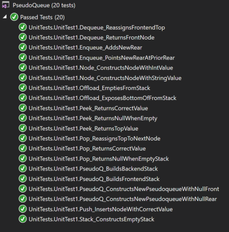

# data-structures-and-algorithms
CF 401 .NET - Code Challenge 11 - PsuedoQueue

## Challenge
Create a class that uses 2 stacks to simulate a queue, with methods for Enqueue and Dequeue.

## Approach
Queues are defined by the ability to accept new nodes at the Rear and eject (or inspect) nodes from the Front. The key is that they are accessible at both ends, but each end has its own ability and limitation.
Stacks do all 3 operations (accept, eject, inspect) from the same end ('Top'), and the other end is inaccessible.
A queue can be simulated by 2 queues by exposing the inaccessible ends of the stacks. This is accomplished by moving all nodes into a single stack, where the Top of that stack is populated with the node that was previously at the bottom of the other stack. The bottom of one stack becomes the 'Front', while the bottom of the other stack becomes the 'Rear'. Behaviors requiring access to Front (Dequeue) are enabled by moving all nodes to the stack whose bottom acts as 'Rear' (and its Top is then 'Front'). Behaviors requiring access to Rear (Enqueue) are enabled by moving all nodes to the stack whose bottom acts as 'Front' (and its Top is then 'Rear'). These 'moves' are accomplished by using the Stack methods 'Pop' and 'Push':

    Example: 
      frontend.Push(backend.Pop())
        (pops the top from stack 'backend' and pushes it to the top of stack 'frontend')

Whiteboard representation of the solution approach:

## Create new classes
'Classes' contains classes for Pseudoqueue, Stack, and Node. Classes contain methods to facilitate common actions for each structure, including constructing, adding, removing, and viewing.
Create a Node class with the following properties and methods:
 - Value: integer value contained in the node (required)
 - Next: Node object that references the next node in the same queue/stack (null ref at instantiation)
 - Node (constructor): requires int input to assign initial value of node object
Create a Stack (FILO/LIFO) class with the following properties and methods:
 - Top: Node object that references the stack's 'Top' node
 - Push(value): Creates a new node of specified value and adds it to the 'Top' of the stack.
 - Pop(): Removes the Top node and returns its value, and reassigns Top to next in line.
 - Peek(): Returns a reference to Top for viewing.
Create a PsuedoQueue (FILO/LIFO) class with the following properties and methods:
 - Front: Node object that references the node at the bottom of 'frontend'
    Get: backend.Push(frontend.Pop) until frontend.Top = null, return backend.Top
    Set: (empty)
 - Rear: Node object that references the node at the bottom of 'backend'
    Get: frontend.Push(backend.Pop) until backend.Top = null, return frontend.Top
    Set: (empty)
 - PseudoQueue (constructor): Creates 2 empty stacks, assigns 'Front' and 'End' to null
 - Enqueue(value): Creates a new node of specified value and adds it to the rear of the queue
    - access Rear as described above
 - Dequeue(): Removes the Front node and returns its value, and reassigns Front to next in line
    - access Front as described above

## Approach & Efficiency
Unlike a true 'queue', each method requires full traversal of the dataset in order to expose the 'ends' (ie - bottoms of the 2 stacks) so that they can be manipulated (ie - adding/removing/inspecting the 'end' node). Hence, for efficiency, dataset size is material - time complexity is O(H) (where H is the height of the stack, or the number of nodes it contains)for all methods. Since 2 stacks - each large enough to hold the entire dataset - must be created, space complexity is O(H) also.

## Solution
This challenge included a set of unit tests verifying that:
  - constructors build objects correctly
  - methods that remove nodes return the value of the correct node and reassign endpoints correctly
  - methods that add new nodes attach them correctly and reassign endpoints correctly
  - methods that inspect nodes return a reference to the correct node

