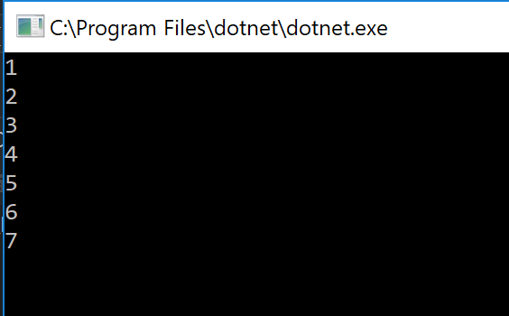
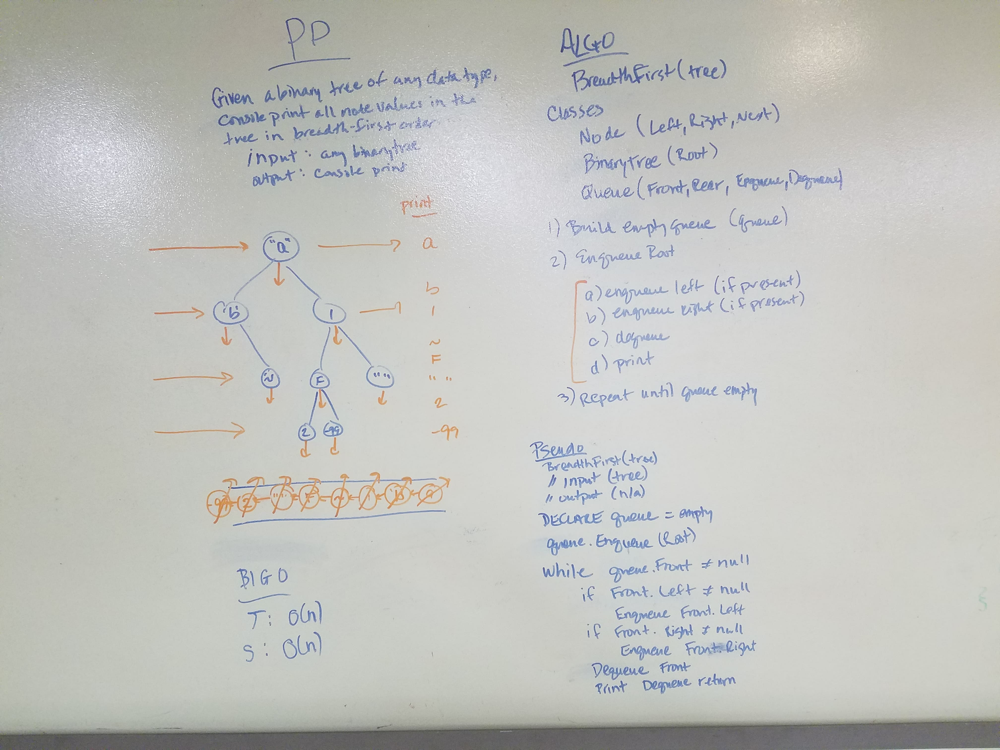
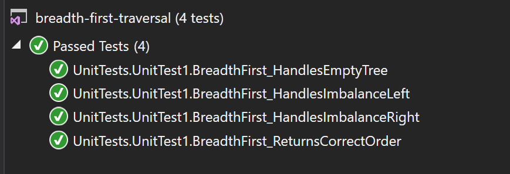

# data-structures-and-algorithms
CF 401 .NET - Code Challenge 17 - Breadth-First Traversal

# Challenge
Given any binary tree, console print its nodes' values in breadth-first order.

## Installation / Run Instructions
1. Clone this repo locally.
2. Launch \\code-challenges-401\challenges\breadth-first-traversal\breadth-first-traversal\breadth-first-traversal.csproj (in Visual Studio 2017 or later).
3. Compile and run - console will launch with solutions automatically as shown below:

## Approach
(Uses custom Node class (contains Left, Right, and Next - works for both Queues and Trees))
Instantiate an empty queue. Enqueue the tree's Root into the queue. Then, for each node at Front of queue:
 - if it has a left child, enqueue the left child
 - if it has a right child, enqueue the right child
 - print the Front value to the console
 - Dequeue the Front node
The implemented solution also loads each node's value into a list (and returns an array built from that list), but this is for testing and validation only.

Solution approach:

## Efficiency
Since this algorithm touches each node, the time complexity is O(n). A queue is instantiated, but it only holds 3 values at any time, so solution space complexity is O(1). (The list and queue built for validation increase the space complexity to O(n)).

## Unit Tests
Unit tests (and console cases) verify that correct results are returned from:
 - a complete, balanced tree
 - an empty tree
 - a tree with a left-leaning imbalance
 - a tree with a right-leaning imbalance

## Credit
Whiteboarding was a collaborative effort by:
 Shalom Belaineh - https://github.com/shalina2
 Gwen Zubatch - https://github.com/GwennyB
