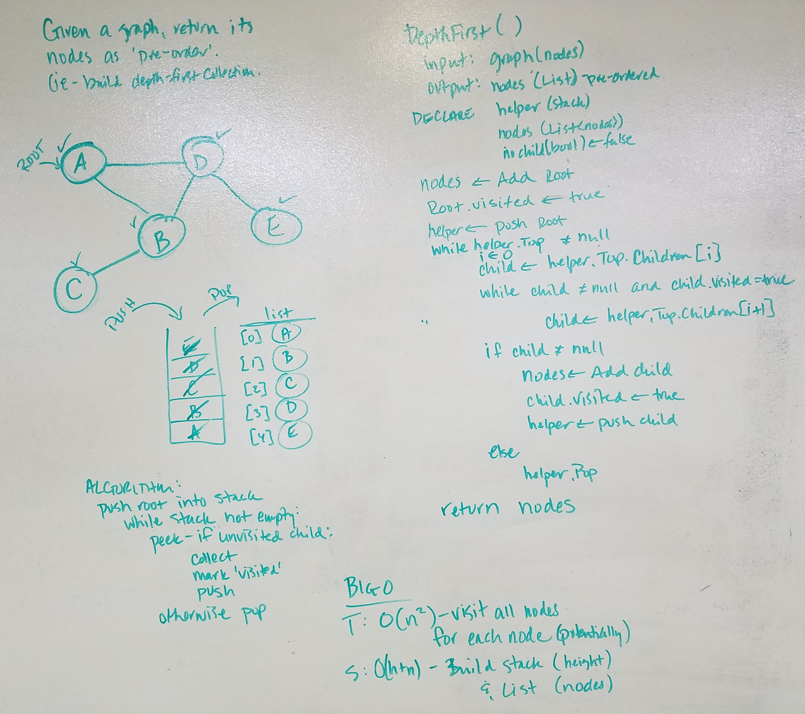

# data-structures-and-algorithms
CF 401 .NET - Code Challenge - Depth-First Traversal of a Graph

## Challenge
Given a graph, return a list of its nodes pre-ordered (ie - using depth-first traversal with root before children)

## Approach
TBD

## Efficiency
TBD

## Solution
TBD

