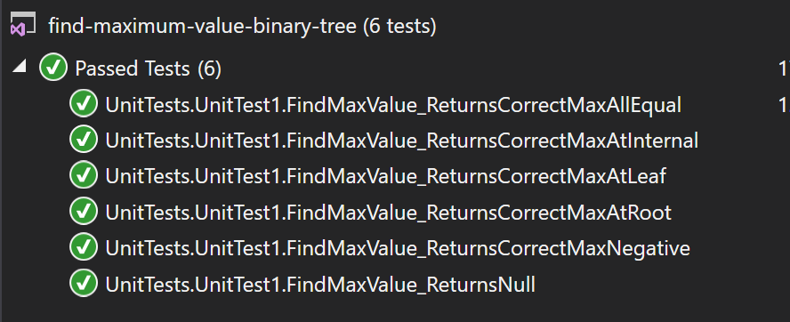

# data-structures-and-algorithms
CF 401 .NET - Challenge 18 - Find Max in Binary Tree

# Class Structure
'Classes' contains custom classes for Tree, BinaryTree, and Node. Classes contain basic properties and constructors only - all relevant methods are in Program class.

## Challenge
Create a method that accepts any binary tree and returns its max value.

## Installation & Run
1. Clone this repo.
2. Launch \\challenges\find-maximum-value-binary-tree\find-maximum-value-binary-tree\FindMax.csproj 
    (use Visual Studio 2017 or later) 
3. Compile and run - console will launch automatically.

## Considerations
Binary trees will contain just integer values. However, the tree may be empty, filled with positive and/or negative values, and it may contain duplicates. The return value must accommodate 'null'. All nodes must be checked since binary trees aren't sorted.

## Approach
Because this solution requires a payload (the 'max' value will need to follow the recursion), an indirect recursive call is used (ie - a primary method that can be called by Main and a private 'helper', which is an overload of the primary). 

PRIMARY METHOD:
1. If the tree is empty (ie - root is null), return null and report results.
2. If the tree has at least a non-null root, assign its value to a new accumulator, and send both the root and the accumulator to helper for comparison with all nodes - final return is the accumulator.
3. Return accumulator as object. 

HELPER METHOD:
Recursive check - 
  - if left, then left
  - if right, then right
  - update accumulator with node's value if it's greater
  - return accumulator

## Efficiency
Recursive time efficiency is O(n) (each node is checked) and space is O(H) (height of tree determines max height of call stack).

## Unit Tests
Unit tests (and console cases) verify that:
 - calls with empty trees return null
 - calls with negative, positive, or all equal trees return correct max
 - max value in root, leaf, and internal nodes return correct max

