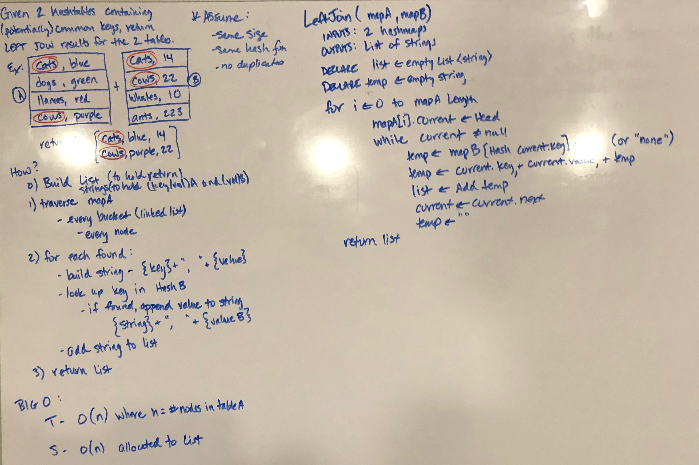
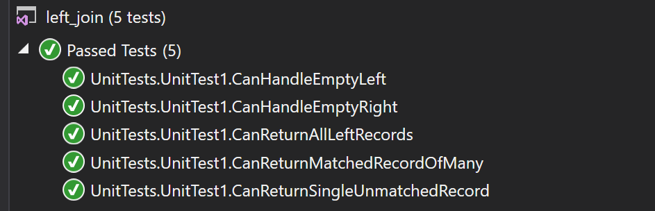

# data-structures-and-algorithms
CF 401 .NET - Code Challenge - Hashmaps Left Join

## Challenge
Return the LEFT JOIN of 2 hashmaps.

## Approach
A 'left join' is an operation that returns *all* entries from the first dataset along with all entries *with matching key* from the second dataset. The value of hashmaps is the ability to navigate directly to the location where a specified key is stored with its value - without a key to search, it is little more than an array of linked lists lacking an additional organizational protocol. That efficiency is lost (in part) in this challenge as a result.

This solution maps traverses the first hashmap (array), and each linked list within each non-null bucket. Each node's key and value are appended to a string ('temp'). Each key is searched in the second hashmap - if located, its value is also appended to the string. The string is added to a list, and the next node in the first hashmap is collected in the same fashion.

## Efficiency
All nodes must be visited in order to satisfy 'left join' rule (return all matches from A), so time complexity is O(n) (where 'n' is # nodes in first hashmap + empty buckets in first hashmap). A list containing all pairs in first hashmap is allocated, so space complexity is O(n) (assuming no empty buckets).

## Solution
This challenge included a set of unit tests verifying that:  
  - list of all records in HashA are returned
  - correlating HashB values are appended to list
  - HashA records without HashB correlation returns 'none' for HashB value
  - empty lists are handled (both A and B)

