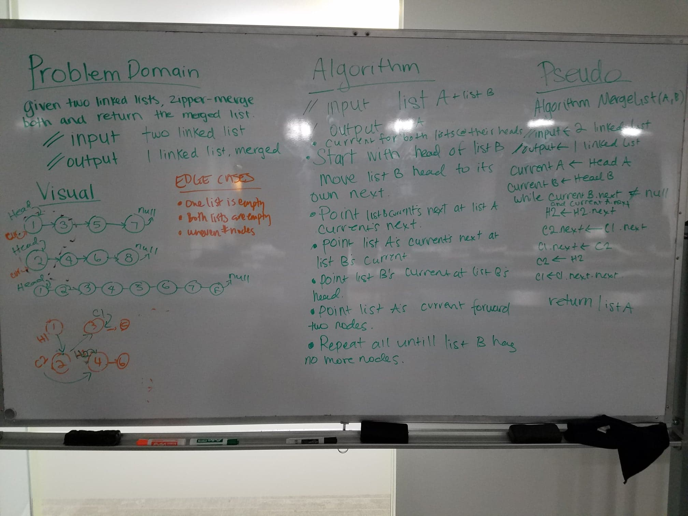

# data-structures-and-algorithms
CF 401 .NET - Code Challenge 8 - List Merge

## Challenge
Given 2 linked lists, zipper-merge them and return the merged list. Avoid use of built-in methods, but use (previously built) linked list classes.
  Ex:
    ListA: Head -> 1 -> 3 -> 5 -> 7 -> null
    ListB: Head -> 2 -> 4 -> 6 -> 8 -> null
    Return: Head -> 1 -> 2 -> 3 -> 4 -> 5 -> 6 -> 7 -> 8 -> null

## Approach & Efficiency
ListB is the 'donor' and ListA is the 'recipient'. Each ListB node (in turn) begins as 'head' and is moved into ListA. The move is accomplished by:
  1. moving 'head' one node to the right
  2. redirecting the node's 'next' to ListA 'next'
  3. redirecting ListA's 'head' at the moving node
  4. shifting 'current' on both lists to the next set of nodes
No additional memory is allocated for these steps, so space efficiency is O(1).
Both lists are traversed exactly once (regardless of length), so time efficiency is O(n).

## Testing
Tests verify that BuildList can build a list of specified size (including an empty one), that Merge produces a properly merged list when the lists are the same size or when either list is longer than the other.

## Solution

## Credit
Whiteboarding was a collaborative effort by:
 - Ryna Truong - https://github.com/rynnnaa
 - Gwen Zubatch - https://github.com/GwennyB