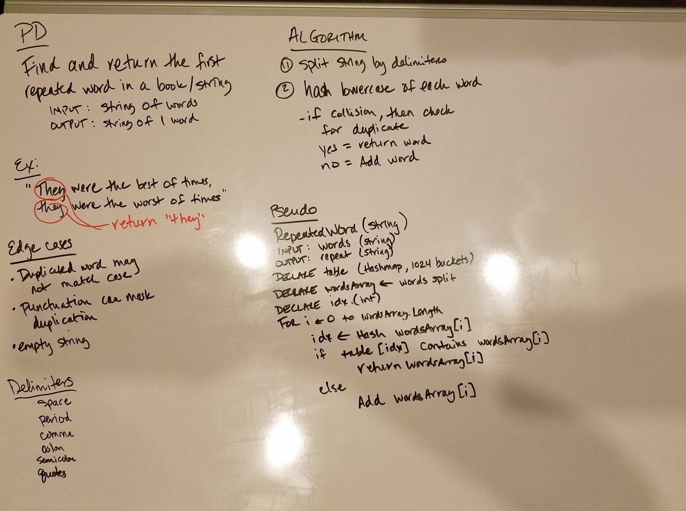
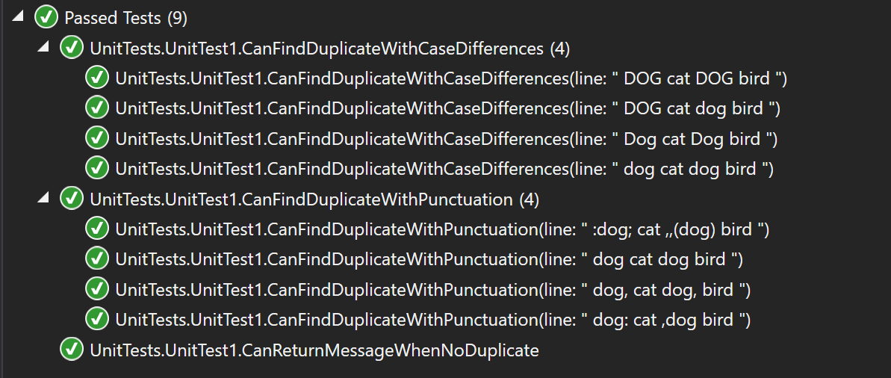

# data-structures-and-algorithms
CF 401 .NET - Code Challenge - Find First Repeated Word In Long String

## Challenge
Write a function that accepts a lengthy string parameter.
Without utilizing any of the built-in library methods available to your language, return the first word to occur more than once in that provided string.

## Approach
This solution splits the incoming string into words by a set of delimiters (single space and a variety of punctuation). It stores each word in a hashtable after checking the hash index for a match. Once a match is found, it is returned and the method is complete.

## Efficiency
This approach allocates an array that holds all words in the string (n/2 max length, where 'n' is - at most - the number of characters in the string), so space complexity is O(n). Hash lookup is O(1); however, string split is O(n), and hash operation adds time based on length of the word - O(n) worst case (if first duplicate is last word).

## Solution
This challenge included a set of unit tests verifying that:  
  - duplicates can be identified regardless of differences in case
  - duplicates can be identified regardless of puntuation
  - a string without duplicates returns a message to that effect

