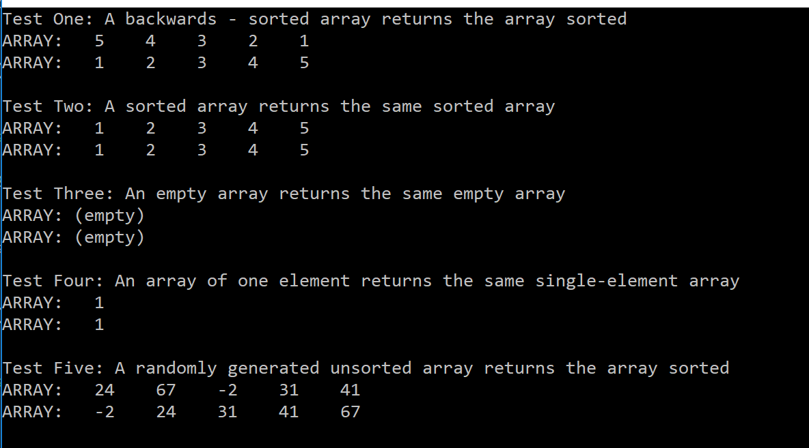
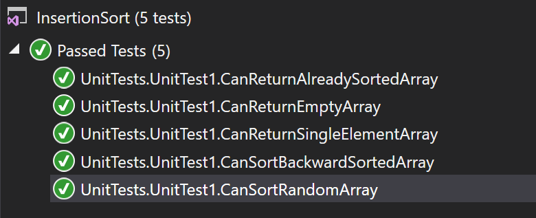

# data-structures-and-algorithms
CF 401 .NET - Code Challenge - Sorts
This group of challenges explores several common approaches to sorting collections.

## Insertion Sort
### Approach
This solution is a double-nested loop, wherein the outer loop selects each element in turn to compare to the others, and the inner loop shifts those that are larger than the currently-in-play element to the right one position and re-inserts that element in the opening left by each larger element.

### Efficiency
This approach has a time complexity of O(n^2) since it compares each element to every other element, and a backwards-sorted array will cause the inner loop to traverse all the way to index 0 on every outer loop index. It is space efficient since it allocates only a few constants for the work, regardless of dataset size.

### Solution
This challenge included a set of unit tests verifying that:
  - A randomly generated unsorted array returns the array sorted  
  - A sorted array returns the same sorted array  
  - A backwards-sorted array returns the array sorted  
  - An empty array returns the same empty array  
  - An array of one element returns the same single-element array  

