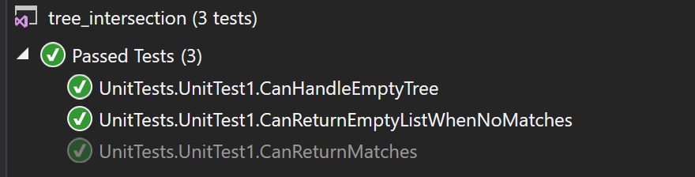

# data-structures-and-algorithms
CF 401 .NET - Code Challenge - Tree Intersection

## Challenge
Given 2 binary trees, build and return a set of all values found in both trees.

## Approach
This solution maps traverses the first tree (breadth-first) and adds all unique values to a hashmap. It then traverses the second tree (again, breadth-first), checking for that value in the hashmap, and adding those found in the hashmap to a list while removing them from the hashmap. The list is returned after second tree traversal completes.

## Efficiency
All nodes must be visited in order to find all matches, so time complexity is O(n). Since the hashmap will hold all values in 1 tree (up to n-1), and a queue must be allocated for traversal (queue length = widest tree width), space complexity is O(n+w).

## Solution
This challenge included a set of unit tests verifying that:  
  - returns matches for 2 unique trees
  - returns matches without duplication when present in trees
  - returns null list when at least 1 tree is empty or no matches exist

