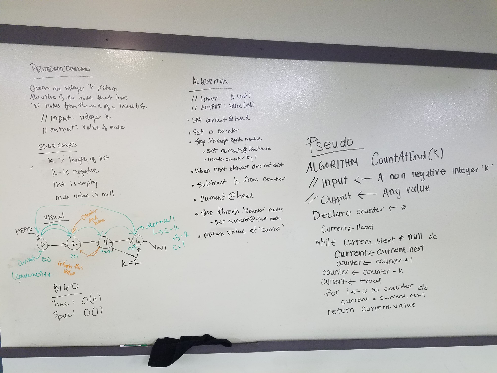
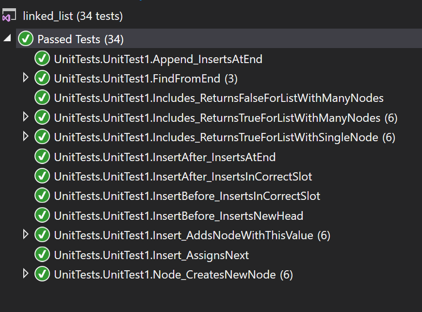
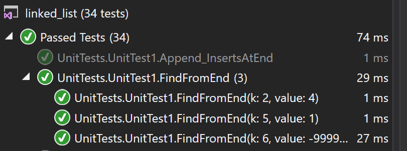

# data-structures-and-algorithms
CF 401 .NET - Code Challenge 5 - Linked Lists

# Create new classes for linked lists and nodes
Create classes for linked lists and nodes. Classes contain methods to facilitate common actions for lists and nodes.

## Challenge
Create a Node class with the following properties and methods:
 - Value: integer value contained in the node (required)
 - Next: Node object that references the next node in the same list (null ref at instantiation)
 - Node (constructor): requires int input to assign initial value of node object
Create a LinkedList class with the following properties and methods:
 - Head: Node object that references the list's 'head' node
 - Current: Node object that references the node currently selected for work/manipulation/etc.
 - Insert (method): Instantiates and inserts a new node (of specified value) into the list, and points 'head' at it.
 - Includes (method): Checks list for the first node that contains the passed-in value - returns 'true'. If none, returns 'false'.
 - Print (method): Console prints the values of all nodes in the list
 - InsertBefore (method): Instantiates a new node (of specified value) and inserts into the list BEFORE an existing node (of other specified value). If no match exists, no node is inserted.
 - InsertAfter (method): Same as InsertBefore, except it inserts the new node AFTER the existing node (or none if no match);
 - FindFromEnd (method): Finds the node 'k' spots from the end of a list and returns the value of its predecessor. Whiteboard solution for this method shown below.
  *** default constructor only - no custom constructor defined ***
 

## Approach & Efficiency
LinkedList.Insert adds a new node, points it to the previous 'Head' as 'Next', and makes it the new 'Head' in just 3 steps. Time complexity is O(1) (since it performs this set of operations just once regardless of the size of the linked list). Space complexity is O(1) since only a fixed amount of space is allocated (regardless of list size).
LinkedList.Includes starts at 'Head' and compares the passed-in value to each node in turn. Time complexity is O(n) (since - at worst, when the matching value is the tail node - it performs this operation for every node in the linked list). Space complexity is O(1) since only a fixed amount of space is allocated (regardless of list size).
LinkedList.Print visits each node once, so time complexity is O(n). No new memory is allocated.
LinkedList.InsertBefore, .InsertAfter, and .FindFromEnd have same time and space complexity as .Includes because they all traverse the entire list at least once, but no more than twice (worst case).

## Solution
This challenge included a set of unit tests verifying that:
  - Includes returns 'false' when the checked value isn't present in the linked list
  - Includes returns 'true' when a multi-node list contains the checked value ***
  - Includes returns 'true' when a single node list contains the checked value
  - Insert adds new nodes ***
  - Insert assigns the correct value of 'Next' when instantiating new 'Head'
  - Node constructor properly creates new nodes ***
  - FindFromEnd returns correct node's value if present, or -999999999 if search parameter exceeds list length

   *** checked 0, positive integers of multiple orders, negative values of multiple orders, positive double converted to int

 
 